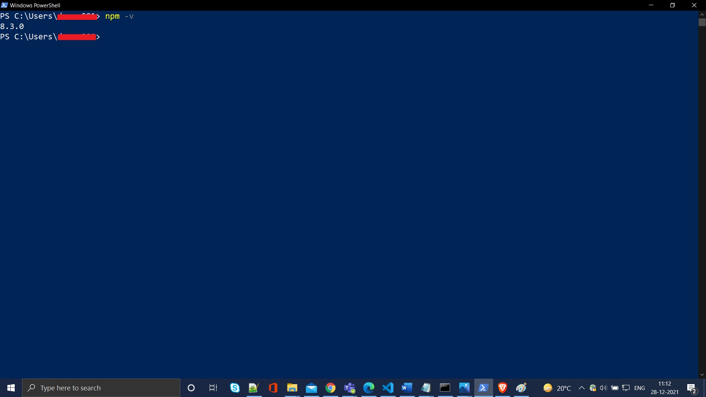

# webdriverio
webdriverio for BBD internal use

## Installation Tools & Software

* Download Node.js in system using following URL 

  <https://nodejs.org/en/download/>

* After download Node.js cofigure enviroment variables in System variable

    ``NODE_HOME "home directory of node.js"``
    
    ``path set "home directory of node.js"``
    
    
* To check whether node.js is install in your machine or not. 
* open command prompt / Windows Powershell and 
* hit following command

    ```
    node -v
    ```
    
    
    
    
* To install webdriverio need to check npm is installed in your PC or not to, to check version open command promt / Windows Powershell and Enter command
     ```
     npm -v
     ```
    
    
* If npm is not present in system just update system variable path 

    ``path set C:\Program Files\nodejs\node_modules\npm\bin`` 
    
    
* To install webdriverio follow 

    <https://webdriver.io/>
    
* Tool for creating framework you need download VS code editor 
* To download VS code 

    <https://code.visualstudio.com/download>
    
* Enter the following command to install webdriverio in system

    ```
    npm install webdriverio --save-dev
    ```
    
     
     

* To Download cucumber dependencies ,Enter the following command it will download all necessary dependencies

     ```
     npm install cucumber --save-dev
     ```
     
     
     
 * To Configure webdriverio need to enter following command
 
    ```
    npx wdio config
    ```
   
     
     
  * Execution command for the script
  * How to run the script
  
  i Using script command 
  ```
  npx wdio run wdio.conf.js
  ```
  
  ii After making changes in script in Package.json we can run our script using following command
    
  ```
  npm run test
  ```
  
  * To generate Allure Report enetr the following command
  ```
  allure generate allure-results
  ```
  * To Open Allure Report enter the following command
  ```
  allure open
  ```
  
  
     
     
    
    
